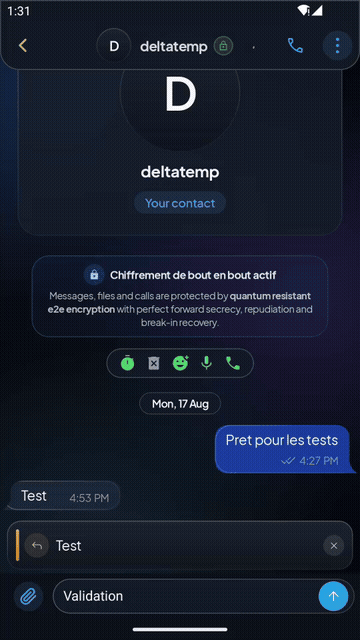
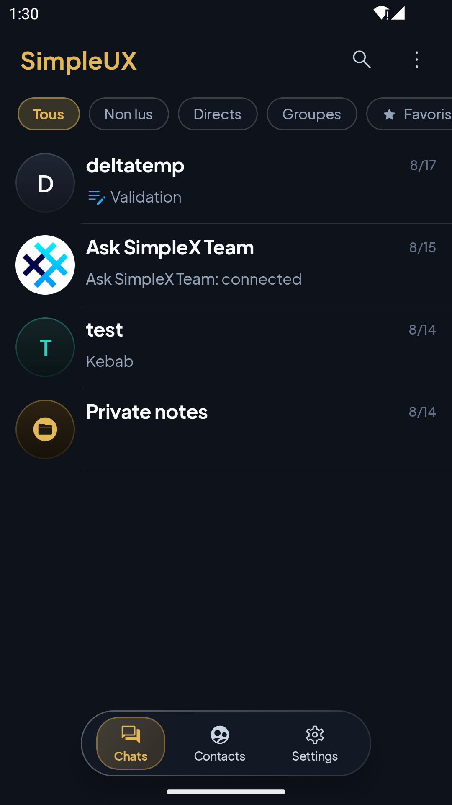
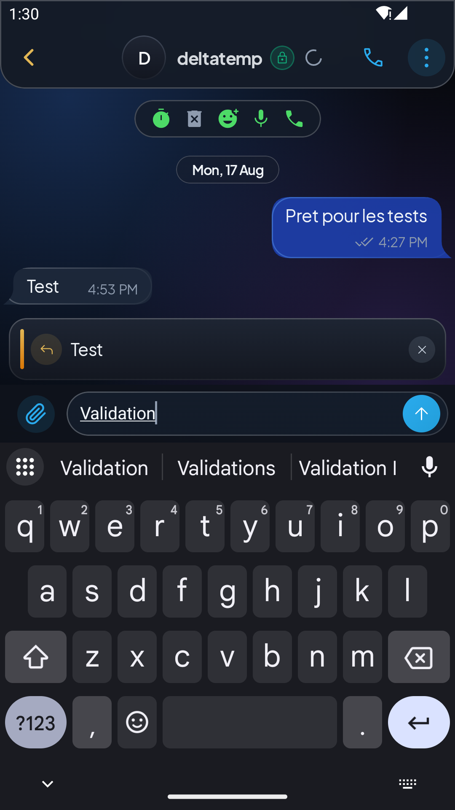
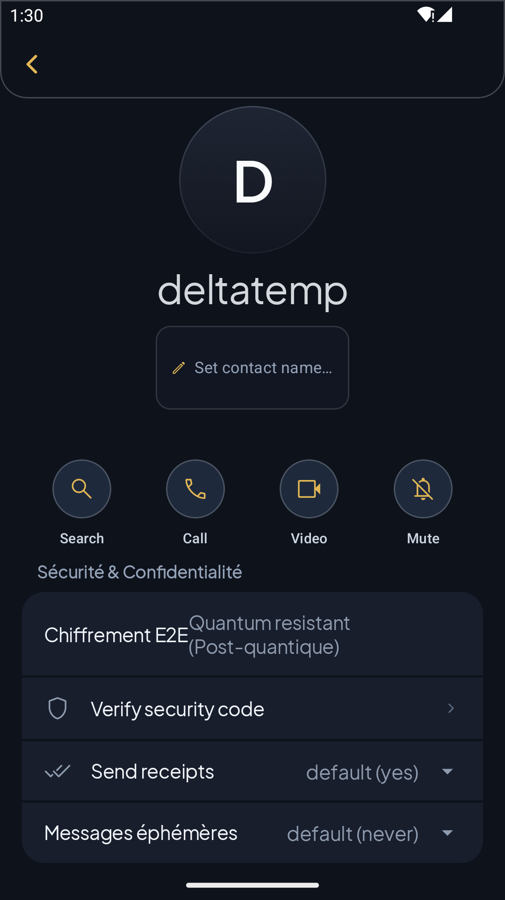
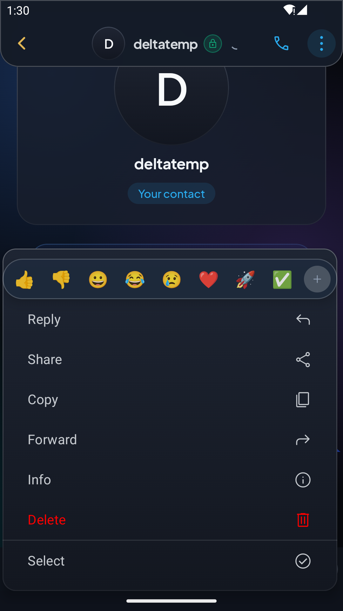
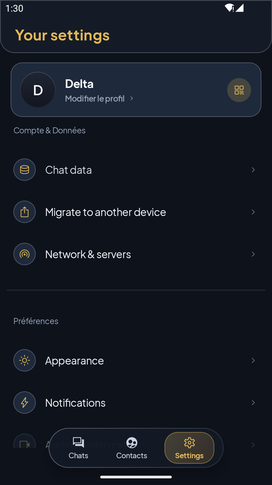
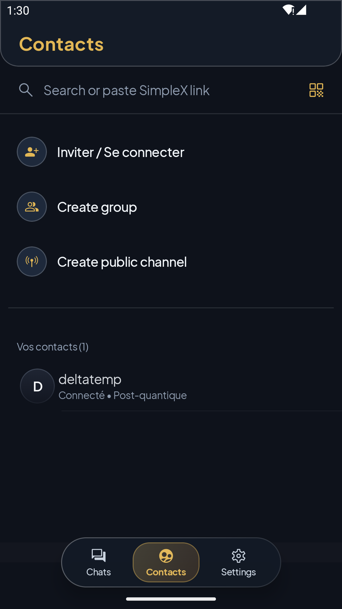

# SimpleUX Chat 💬

> **A personal, UX-first fork of SimpleX Chat - same protocol, same untouched core, an interface I can actually live in every day.**

[](./LICENSE)
[](https://simplex.chat)
[](#-side-by-side-coexistence)
[](#-building--running)
[](https://github.com/delta-whiplash/simpleUx-chat/actions/workflows/simpleux.yml)

---

<div align="center">

### 🎬 Live Interface Demo



*Fluid 3-tab navigation, instant contact routing, and real-time post-quantum indicators.*

</div>

---

## 🌟 Why this fork exists

**SimpleX Chat** is a cryptographic masterclass: the first messaging platform with **no user identifiers of any kind**, end-to-end encryption with post-quantum resistance, and isolated unidirectional messaging queues. It is a project with **a lot of potential** - and one that deserves far more contributions toward its user interface.

**This fork exists because I wanted to live in SimpleX every day, and the interface made that hard.** To be blunt: the UX felt dated and unpleasant for daily use - at least, to me.

And to be clear about the ambition: **I am not claiming this UI is better - it is not, by far.** I am simply implementing, for my own use, the interaction patterns I find pleasant in the messengers I already use every day, so that moving to the SimpleX ecosystem stops feeling like a comfort downgrade. If some of it is useful to you, welcome.

**Why a fork instead of pull requests?** I would genuinely have preferred to contribute this upstream. But the number of long-open pull requests on the parent project made it obvious that interface changes of this scale would land far too slowly for someone who wants to *use* the app today, not in a few years. This fork is that impatience made useful.

What moves here: the frontend only (Kotlin Multiplatform / Compose). The authoritative Haskell core engine (`libsimplex` / `libapp`) and the JNI/FFI cryptographic bindings stay **100% untouched and fully interoperable** with official SimpleX clients.

---

## 📸 Interface Showcase

<div align="center">

| 🪐 **Chats & Filter Pills** | 💬 **Conversation & Security Badge** |
|:---:|:---:|
|  |  |
| *Filter pills (All, Unread, Direct, Groups, Favorites), circular monogram discs with specular rims, and floating island bar.* | *Real Post-Quantum SecurityBadge, composer with draft persistence, and attachment sheet.* |

| 🛡️ **Contact Profile & Verification** | ⚡ **Reactions & Quick Actions** |
|:---:|:---:|
|  |  |
| *120dp Titanium disc, SAS fingerprint verification, live SMP relay queues, and local contact aliases.* | *Quick emoji reaction picker (👍 👎 😄 😂 😢 ❤️ 🚀 ✅) and modular context action menu.* |

| ⚙️ **Settings & Profile Studio** | 👥 **Contacts & Quick Invitations** |
|:---:|:---:|
|  |  |
| *User profile card with instant QR share, categorized preferences, network diagnostic tools, and dark/light modes.* | *One-tap invite links, encrypted group creation, public broadcast channels, and connected status indicators.* |

</div>

---

## 💎 Design Language: Luxury Mineral & Haute Horlogerie

SimpleUX introduces an elevated visual aesthetic crafted for discretion, clarity, and tactile precision:

- **Circular Titanium Discs:** Avatars use perfectly circular geometry with a 1.dp hairline specular highlight rim (`#26FFFFFF` dark / `#1A000000` light) for a machined mineral feel.
- **Champagne Gold Accents:** Key interactive states (active navigation tab, reply indicator, security highlights) use subtle champagne gold (`#E2B755` dark / `#D97706` light).
- **Floating Island Navigation:** A 3-tab bottom bar (*Chats*, *Contacts*, *Settings*) floating gracefully over conversational content.
- **Authentic Security States:** The `SecurityBadge` dynamically evaluates real double-ratchet post-quantum negotiation (`connPQEnabled` in both directions) with zero simulated states.

---

## 🚀 Key Pillars

| Pillar | Description |
|---|---|
| 🎨 **Elevated UI/UX** | Refined modern design system, fluid micro-interactions, emoji reaction picker, and ergonomic message bubbles. |
| 🤝 **100% SimpleX Interoperability** | Fully interoperable with official SimpleX clients (Android, iOS, Desktop, CLI). Communicate seamlessly with zero wire-format divergence! |
| 📱 **Side-by-Side Coexistence** | Engineered with unique application IDs (`chat.simplex.ux`) and isolated sandboxes to install alongside the official app on the same phone. |
| 🔒 **Untouched Zero-Metadata Core** | Preserves all cryptographic guarantees: double-ratchet E2EE, Kyber/ML-KEM PQ key exchanges, unidirectional SMP queues, XFTP file transfers, and SQLite DB encryption. |
| ⚡ **Frontend Focused** | The Haskell backend engine (`libsimplex` / `libapp`) remains authoritative. We focus 100% of our development on frontend excellence. |

---

## 📱 Side-by-Side Coexistence

SimpleUX is built from the ground up to **coexist** peacefully with the official SimpleX app on any device:

- **Unique Application ID:** Configured as `chat.simplex.ux`; an optional debug id can be enabled via the `application_id.suffix` Gradle property (empty by default).
- **Isolated Sandboxes:** Separate local SQLite databases, keychain groups, and media cache folders.
- **Dedicated Content Providers:** Uses `chat.simplex.ux.provider` to prevent any authority collisions.
- **Independent Sync Services:** Background message notifications run autonomously without interfering with standard SimpleX apps.

---

## 🏗️ Architecture Overview

SimpleUX preserves the multi-tier architecture of SimpleX, isolating UI/UX advancements strictly to the presentation layer:

```
┌─────────────────────────────────────────────────────────────────────────┐
│                     SimpleUX UI Layer (Compose & SwiftUI)               │
│  • Luxury Mineral Tokens (Color, Shape, Typography, Specular Rims)      │
│  • Redesigned Views (ChatList, ChatView, ChatInfo, Settings, Contacts)  │
│  • Message Actions (Reaction picker, Draft persistence)                 │
└─────────────────────────────────────────────────────────────────────────┘
                                   │  ▲
             User Interactions     │  │  StateFlows / Recomposition
                                   ▼  │
┌─────────────────────────────────────────────────────────────────────────┐
│                        Application Logic Layer                          │
│  • ChatModel (State container) & ChatController (Command dispatcher)    │
│  • AppPreferences, NotificationManager, ThemeManager                    │
└─────────────────────────────────────────────────────────────────────────┘
                                   │  ▲
                   sendCmd()       │  │  recvMsg() / processReceivedMsg()
                                   ▼  │
┌─────────────────────────────────────────────────────────────────────────┐
│                   JNI / C FFI Bridge (Core.kt / C)                      │
│  • chatSendCmdRetry() / chatRecvMsgWait()                               │
└─────────────────────────────────────────────────────────────────────────┘
                                   │  ▲
                     C Foreign Function Interface (FFI)
                                   ▼  │
┌─────────────────────────────────────────────────────────────────────────┐
│              Haskell Core Engine (libsimplex / libapp)                  │
│  • Double-Ratchet E2EE, SMP Queues, XFTP File Relays, SQLite DB         │
└─────────────────────────────────────────────────────────────────────────┘
```

---

## 🛠️ Building & Running

### Android & Desktop (Kotlin Multiplatform)

**Prerequisites:** JDK 17-21, Android SDK (API 35), NDK (23.1+), CMake.

```bash
# Navigate to the multiplatform project directory
cd apps/multiplatform

# Run all unit and desktop verification tests
./gradlew desktopTest

# Build Android Debug APK (FOSS Flavor)
./gradlew assembleFossDebug

# Build Android Release APK
./gradlew assembleFossRelease

# Package Desktop App for Current OS (Windows MSI/EXE, macOS DMG, Linux DEB)
./gradlew :desktop:packageDistributionForCurrentOS
```

### Installing builds via Obtainium

Add `https://github.com/delta-whiplash/simpleUx-chat` as a **GitHub** source in
[Obtainium](https://github.com/ImranR98/Obtainium). Every build gets its own
`v*-ux.*` tag, so default version detection works — just enable
**Track prereleases** (all builds except explicit stable cuts are prereleases)
and filter APKs to `arm64-v8a`.

### iOS (Native Swift / SwiftUI)

**Prerequisites:** macOS with Xcode 15+, CocoaPods / Swift Package Manager.

```bash
cd apps/ios
open SimpleX.xcodeproj
```

---

## 📖 Documentation & Guidelines

- **[AGENTS.md](./AGENTS.md)** - Architectural invariants, coexistence strategy, and guidelines for contributors.
- **[Design System Skill](./.agents/skills/simpleux-design-system/SKILL.md)** - Full specification of tokens, colors, shapes, and micro-interaction patterns.
- **[Upstream Documentation](./docs/)** - In-depth specifications of the SMP/XFTP protocols and cryptographic fundamentals.

---

## 🙏 Credits & Upstream Acknowledgment

SimpleUX Chat is an interface fork created with deep respect for the visionary work of **Evgeny Poberezkin** and the **SimpleX Chat core team and open-source contributors**.

- **Official Upstream Repository:** [simplex-chat/simplex-chat](https://github.com/simplex-chat/simplex-chat)
- **Official SimpleX Website:** [simplex.chat](https://simplex.chat)

---

## 📄 License

This software is licensed under the **GNU Affero General Public License version 3 (AGPLv3)**. See the [LICENSE](./LICENSE) file for details.
